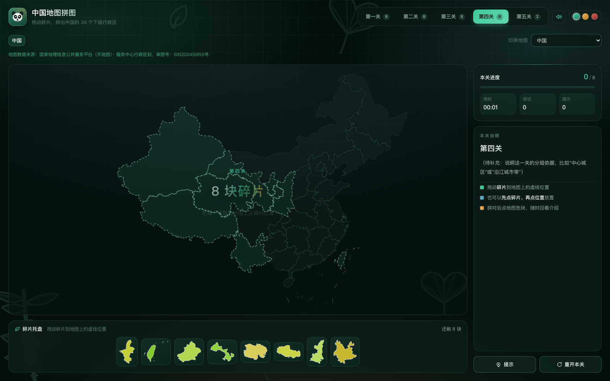

# 地图拼图（多层级）

> **接手/续做请先看 [`HANDOVER.md`](HANDOVER.md)** —— 70 行的接手指南 + 新对话引导语 + 常用命令。
> 接手时只要：读 HANDOVER.md → `node tools/status.js` → `node tools/e2e-test.js 2>&1 | tail -6`。

一个用交互式动画讲解成都行政区划的网页小游戏：把打乱的区县碎片拖回地图上的正确位置，拼对后会弹出该区县的面积、地标和冷知识。

> **本项目已升级为"通用引擎 + 地图工厂"**：引擎不认识任何具体地图；地图包按层级放在 `js/maps/` 下，
> 靠一份自动生成的登记册（`registry.js`）串成一棵树。接入一张新地图是一条命令的事：
> ```bash
> node tools/add-map.js --adcode=510300 --name=zigong --parent=sichuan
> ```
> 父级没接入会自动补全，**不必改动引擎一行**；整批接入用 `node tools/batch-add-maps.js --parent=510000`。
> 目前已接入 **23 张地图**（中国 → 四川 → 21 个市州）。详见[想接入新地图？](#想接入新地图)

- **零依赖**：纯 HTML / CSS / JavaScript，不需要 npm、不需要构建、不需要起服务器
- **零外链资源**：没有一张图片文件、没有一个 CDN 请求 —— 熊猫、竹子、银杏、盖碗茶、川剧脸谱全部是手写的 SVG 路径
- **双击即玩**：直接打开 `index.html` 就能跑（数据已内联，见下文说明）

地图导航（面包屑 + 按层级缩进的地图选择器，切换地图 = 换一张图玩，进度各自独立）：


开场欢迎动画（同一次会话内只播一次，也可点任意位置跳过）：


每关通关后的结算画面（星级评价 + 用时/尝试/提示 + 本关区县印记）：


手绘图案库（`tools/icon-preview.html` 可以单独打开查看）：


---

## 快速开始

```
双击打开 index.html
```

不需要任何构建步骤。如果你更喜欢用本地服务器（比如要调试），随便起一个静态服务器也行：

```bash
python3 -m http.server 8000
# 然后访问 http://localhost:8000
```

## 怎么玩

有三种操作方式，随你习惯：

| 方式 | 操作 |
| --- | --- |
| 拖拽 | 按住托盘里的碎片，拖到地图上的虚线位置松手 |
| 点击 | 先点一下碎片选中它，再点地图上要放的位置 |
| 键盘 | Tab 聚焦碎片 → 回车选中 → Tab 到空位 → 回车放下 |

- **放对了**：碎片会平滑缩放进地图上的真实位置，区块弹一下，响起一声清脆的上行音，右侧弹出该区县的介绍
- **放错了**：凹槽闪红、碎片抖两下飞回托盘、一声低沉的闷响，并告诉你"这里是×××，×××还在别处"
- 拼对之后，**点地图上的任意彩色区块**可以随时回看它的介绍
- 右侧面板里有「提示」和「重开本关」
- 顶栏右侧可以**切换配色主题**（三个色点）和**开关音效**（喇叭图标）

**进度会自动保存**：拼到哪、花了多久、试了几次、用了几个提示，全都记着。刷新、关标签页、甚至关掉浏览器再打开，都能接着上次继续。

## 六套玩法模式（全部本地离线）

顶栏「玩法」下拉切换。**六套模式共用同一套引擎** —— 引擎只认 5 个通用开关
（`pieceNames` / `hintLimit` / `softenFeedback` / `disableMotion` / `onPlacement`），
具体规则在 `js/modes.js`（纯逻辑层，108 项单测）。加第七套模式不用改引擎。

| 模式 | 做什么 | 面向谁 |
| --- | --- | --- |
| **普通模式** | 默认玩法，界面与以前完全一致 | 所有人 |
| **计时挑战** | 三档难度（简单·提示不限 / 普通·提示 3 次 / 困难·无提示且藏地名）；按图按难度记个人最佳；自动收集易错行政区成"薄弱练习集" | 想刷成绩的人 |
| **教学学习** | 碎片**永久显示地名**；可勾选部分行政区单独练；课堂大屏布局；**导出 Markdown 练习报告**；一键跳百科参考 | 地理老师 |
| **考试刷题** | 藏地名、提示 0 次、关闭动画、计时；结束给正确率、评级与错题清单 | 学生自测 |
| **儿童模式** | 简化统计（隐藏得分/连击）、提示不限、只用鼓励文案 | 小学生 |
| **本地双人对战** | 同一台设备两人轮流拼，一块一轮，放对 +10 放错 −3 | 两个人一台电脑 |

**全部本地离线**：不联网、不需要账号、没有匹配对战。
进度、最佳成绩、错题集、对战战绩全在 `localStorage`。

模式可以直接用链接指定，**老师发一条链接就能把学生带进考试模式**：

```
?mode=exam&diff=hard      考试模式 + 困难难度
?mode=teach&big=1         教学模式 + 课堂大屏
?map=china&mode=teach&pick=110000,120000   只练北京和天津
```

## 发现资料写错了？

每个区县的介绍卡底部都有一个「发现写错了 / 想补充这条」按钮，导航条上也有一条地图级入口。
点开以后会把你看到的**那一张卡**拼成一段结构化文本：

```
### 位置
- 地图：乐山市（`leshan`）
- 区县：五通桥区（`511112`）

### 应该是          ← 你只需要写这一节
### 来源            ← 以及这一节
```

然后走你自己已有的通道发出去，**GitHub Issue / 邮件 / 复制粘贴**三选一 ——
这个网站没有后端，也不会为了收一条反馈去搭一个。

> **为什么「来源」是必填的**：没有来源的修改我们不敢合。
> 一个热心人说"我们县面积是 1200 平方公里"，如果直接信了，
> 就把一条**看起来权威的错误数据**写进了站里 —— 那比留空更糟，因为留空至少是诚实的。

想真的收 Issue，把 `index.html` 顶部的 `MAP_PUZZLE_CONTRIB.repo` 换成你的仓库就行
（留空时会自动降级成"复制到剪贴板"，不会给出死链接）。

## 发一个文件就能让人玩到（零成本传播）

```
node tools/bundle.js --province=sichuan     # → out/地图拼图-四川省.html（1.3MB，22 张地图）
node tools/bundle.js --maps=chengdu         # → 单张地图，约 300KB
```

产物是**一个自包含的 HTML**：样式、脚本、地图数据全部内联，
没有 `<script src>`，没有 `<link rel=stylesheet>`。双击就能玩，不需要网络、不需要服务器。

> 为什么不先部署：GitHub Pages 在国内属"半墙"、**Gitee Pages 已下线**、
> Cloudflare Pages 免费但速度一般。对一个还没人知道的网站来说，
> "有链接"不等于"有人打开"，而"发一个文件给同学、他双击就能玩"是**必然成功**的。
> 顺序是「先发文件验证有没有人想玩 → 有了再谈部署」，
> 详见 `docs/可持续性与内容生产.md` §六。

## 关卡

按离市中心的距离（成都人说的"圈层"）分成三关，5 + 7 + 8 = 20 个区县：

| 关卡 | 数量 | 区县 |
| --- | --- | --- |
| 第一关 · 中心城区 | 5 | 锦江、青羊、金牛、武侯、成华 |
| 第二关 · 近郊七区 | 7 | 龙泉驿、青白江、新都、温江、双流、郫都、新津 |
| 第三关 · 远郊八区县 | 8 | 都江堰、彭州、崇州、邛崃、简阳、金堂、大邑、蒲江 |

通关后解锁下一关，解锁进度和关卡内进度都存在 `localStorage` 里（刷新、关标签页、关掉浏览器再打开都能接着玩）。
URL 加 `?level=2` 可以直接跳到第三关（同时解锁全部关卡），方便调试和分享。

## 项目结构

```
index.html                    页面结构 + 手绘 SVG 图案库（<symbol> 定义）
css/style.css                 全部样式与动画 + 设计令牌 + 地图导航样式

js/engine.js                  通用拼图引擎（拖拽、判定、进度、信息卡、存档）—— 不含任何地图数据
js/geomap.js                  墨卡托投影 + path/bbox/质心计算（Polygon / MultiPolygon 都支持）
js/game.js                    启动器 + 地图导航 UI（面包屑 / 选择器 / 纠错面板，宿主层）
js/progress.js                跨地图进度与成就账本（纯逻辑，不碰 DOM）
js/score.js                   计分与连击规则（纯函数，可单测）
js/share.js                   分享卡片：文案是纯函数，绘制用 Canvas
js/contribute.js              众包纠错：把资料卡拼成结构化文本 + Issue 预填链接（纯函数）

.github/ISSUE_TEMPLATE/       三份表单：资料纠错 / 资料补充 / 问题反馈（都强制填来源）

js/maps/                      地图工厂：目录层级 = 地图层级（当前 363 张）
  registry.js                 总登记册【自动生成】—— 谁是谁的父级、脚本在哪
  loader.js                   运行时按需注入脚本（首屏只载 75KB，地图数据用到才下载）
  china.js                    中国（根地图，34 个省级行政区）
  china/sichuan.js            四川省（21 个市州）
  china/sichuan/chengdu.js    成都（20 个区县，资料是人工核实的）
  china/sichuan/leshan.js     乐山（11 个区县，面积由脚本从官方边界算出 + 资料人工核实）
  china/sichuan/zigong.js     自贡市（6 个区县，add-map 一键生成）
  china/sichuan/<18 个市>.js  四川其余 18 个市州（batch-add-maps 批量生成，资料待补）
  每个地图包三个文件：<id>.js 配置 / <id>.geo.js 边界（构建产物）/ <id>.data.js 资料（人工维护）

tools/add-map.js              单张接入（CLI + 可被调用的 addMap() 库函数）
tools/batch-add-maps.js       批量接入一个省/市（21 个市州就是这么来的）
tools/replace-geo-source.js   批量换源（把已有地图整体换成天地图/本地数据包）
tools/lib/wkt.js              天地图返回的是 WKT，这一层转成 GeoJSON
tools/lib/tianditu-geo.js     天地图行政区划接口客户端（需 Key）
tools/lib/geo-source.js       数据源抽象：datav | tianditu | file
tools/test-wkt.js             WKT 转换的离线单测（13 项）
tools/test-maps.js            地图包自洽离线自检（120 项）
tools/lib/slugs.js            adcode ↔ 拼音 slug（省表 / 地级表 / 兜底命名）
batch-report.json             最近一次批量接入的报告（成功/失败/待人工补清单）
tools/build-registry.js       扫描 js/maps/ 生成登记册（children 由 parent 反推）
tools/lib/inline-geo.js       公共库：GeoJSON 规范化 / 内联模块（+ 历史 DataV 下载）
tools/lib/tianditu-portal.js  公共库：天地图官方行政区划服务（现用数据源）+ 二进制解码
tools/tianditu-download.js    抓官方数据到 data/tianditu-official/
tools/test-maps.js            地图包自洽离线自检
tools/soften-placeholders.js  占位文案 → 共建口径
tools/area-from-geo.js        从官方边界几何算面积，写进 .data.js（只改 area，不动文字）
tools/lib/geo-area.js         公共库：球面多边形面积（与 d3.geoArea 同公式）+ 官方公布值锚点
tools/facts-batch.js          批量抓区县素材 → out/facts-<市>.json（1 次调用代替几十轮）
tools/facts-verify.js         核对子代理产出：evidence 能否追溯、面积是否一致、有没偷渡不可信条目
tools/test-facts-verify.js    校验器自测（14 项 · 造 7 种输入，要求"该拦的必须拦住"）
tools/fixtures/verify-prompt.md         委派给子代理的自包含指令模板
tools/fixtures/facts-zigong.sample.json 合成素材夹具（让上面那个自测能离线跑）
tools/lib/facts-source.js     公共库：抓取（磁盘缓存 + 限流识别退避）+ 句子抽取 + 归属校验
tools/status.js               一行命令看现状（地图数 / 面积覆盖 / 文案缺口 / 数据源 / 下一步）
tools/lib/map-tree.js         公共库：目录规则 / 包元信息扫描 / registry 生成
tools/build-data.js           只重刷成都边界的薄封装（新地图请用 add-map）

tools/bundle.js               单文件离线打包（整站内联成一个 .html，微信发文件就能玩）
tools/test-bundle.js          打包器自测（33 项 · 只打成都，秒级）

tools/test-contribute.js      众包纠错自测（33 项 · 文案/编码/降级不许出死链）
tools/test-progress.js        进度账本自测（56 项）
tools/test-share.js           分享文案自测（27 项）
tools/test-score.js           计分平衡自测（28 项）
tools/mca-check.js            拉民政部官方区划树（type 字段）并核对我们的名字
tools/lib/mca-tree.json       官方区划树快照（3213 节点，关卡分组按它分类）
tools/regroup-levels.js       只重排关卡分组（断言 LEVELS 之外字节完全一致）
tools/repair-map-names.js     只修 <id>.js 里的中文显示名（不动 .data.js）
tools/gen-name-map.js         adcode → 官方中文名（3254 条），修拼音名的兜底数据
tools/prune-empty-maps.js     删掉没有下级的退化地图
tools/todo-report.js          按市/按字段列资料缺口（--write 出 docs/资料缺口清单.md）

tools/e2e-test.js             测试驱动（跑三套浏览器套件 + 九项离线检查 + 汇总）
tools/selftest.html           城市回归套件（89 项 · 成都真实数据 + UI/动画）
tools/engine-test.html        引擎功能套件（77 项 · 虚构 tiny-city）
tools/map-smoke.html          多地图冒烟套件（每张地图 38 项 · 真拖一块 + 导航 + 纠错面板 + 窄屏）
tools/engine-host.html        引擎测试用的瘦宿主页（被上面那套装进 iframe）
tools/fixtures/tiny-city.js   虚构测试城市：3 个假区县 + 2 关
tools/shot.js                 截图工具（生成 docs/ 里的界面配图）
tools/icon-preview.html       手绘图案预览（开发用）

docs/                         README 配图（含界面截图与开场/结算画面）
```

## 想接入新地图？

项目分成三层：**通用引擎**（`js/engine.js`，不认识任何具体地图）、**地图包**（`js/maps/` 下的一堆配置）、
**地图工厂**（`tools/add-map.js` 等，负责把地图包生成出来并串成一棵树）。

### 一条命令接入（中国区划，数据源是**天地图官方**）

```bash
node tools/add-map.js --adcode=510300 --name=zigong --parent=sichuan
```

它会：算出该放哪个目录（父级没接入会自动补出四川、中国）→ 下载边界 →
生成三个文件 → 重新生成登记册 → 打印"还需要人工补什么"。

脚本只能生成骨架，**地标 / 冷知识 / 关卡分组得人来补**（在 `<id>.data.js` 里），
这也是为什么一个地图包要拆成三个文件：脚本永远只重写 `<id>.geo.js`，
你手写的 `<id>.data.js` 它一个字都不碰。刷新边界请用 `--geo-only`，
**别用 `--force`**（那会连人工文件一起覆盖）。

### 给地图补资料卡

面积**不用手抄**——它本来就是边界几何的属性，而官方边界已经在项目里了：

```bash
node tools/status.js                                  # 看面积覆盖 / 文案缺口（分开统计）
node tools/area-from-geo.js --check                   # 校验算法：与公布值比对（5/5 通过）
node tools/area-from-geo.js --parent=510000 --write   # 一个省一次：只写 area，文字一个字不动
```

**当前 238/238 条面积已全覆盖。** 实测精度（与公布值比对）：五通桥 465/465、峨边 2383/2382、
乐山全市 12742/12720、绵阳 20256/20200、南充 12491/12482。差异来自制图综合，
所以产物在文件头声明为**"几何计算值"**，不冒充官方统计口径。

工具会把「机器算的」和「人填的」分开对待：`area` 行带 `[geo-area]` 标记的才允许自动刷新，
**人工填的数字默认不动**（要先回滚过一次事故才加的这道闸门，见 SOP 坑 #30）。

剩下 `landmark / tagline / funFact` 三段文字仍是人工活：**只写能核实的公开内容**，
核实不了就保留「📖 资料收录中，欢迎参与共建」，宁缺毋假。
样板见 `js/maps/china/sichuan/leshan.data.js`（文件头列了全部资料来源）。

### 批量补一个市的文字素材

不要"一次一个区县"地查——那是几十轮 tool call，又慢又费。用一条命令抓完整个市：

```bash
node tools/facts-batch.js --map=zigong --delay=3000 --draft --prompt
# 产物：out/facts-zigong.json（素材）+ draft-zigong.md（给人看）+ prompt-zigong.md（给子代理）
```

抓取层带**磁盘缓存**（`.cache/facts/`）和**限流识别**：正常词条页 200 KB–1 MB，
小于 50 KB 一律判为限流页并退避重试，失败就如实标 `⏳ 被限流`——绝不把拦截页当正文。
抓来的面积还会与本地几何面积**交叉校验**，比值异常直接标 `❗`（实测拦下过同名词条抓错）。

**判断也可以委派给子代理**（它在自己的上下文里读素材，主上下文只收结论）：

1. 把 `out/prompt-<市>.md` 整段交给一个子代理（它只读素材、禁止联网）
2. 子代理返回结构化 JSON，每个字段都要附**素材里原样存在的句子**作为 evidence
3. `node tools/facts-verify.js --map=<市> --in=<它的产出>` —— 机械核对：
   evidence 能在素材里找到吗？面积与几何一致吗？撞车/限流条目有没有偷偷写进正文？

> **委派的前提是能核对。** 校验器把"请勿编造"从口头要求变成可执行规则，
> 而它自己有 14 项测试钉着（`tools/test-facts-verify.js`，已进 e2e 离线套件）——
> 守门人自己坏掉必须能被发现。

### 整批接入一个省

```bash
node tools/batch-add-maps.js --parent=510000 --dry-run   # 先看计划
node tools/batch-add-maps.js --parent=510000             # 真跑
```

一次下载父级的子级清单，逐个生成地图包，最后统一重建登记册，并写一份
`batch-report.json`（成功/失败/数据缺口/待人工补的占位符清单）。
某个子级下载失败会**记录并跳过**，不会重试或死循环。
（红线：不允许 `--parent=100000` 一次性接整个中国 —— 脚本会直接拒绝；一个省一个省来。）

### 目录规则（一条递归规则，没有例外）

> 地图 `X` 的包文件 = 父地图的子目录 + `X.js`；某地图的子目录 = 它包文件所在目录 + 它自己的 id + `/`

```
js/maps/china.js                    中国（根）
js/maps/china/sichuan.js            四川省
js/maps/china/sichuan/chengdu.js    成都
js/maps/china/sichuan/zigong.js     自贡市
```

父子关系只需要在子地图里写 `parent`，**父地图的 `children` 由 `tools/build-registry.js`
扫描反推**，所以加一张地图是纯追加操作，不用回头改别人的文件。

### 切换到新地图

页面上顶栏有地图选择器（按层级缩进的下拉）和面包屑（`中国 › 四川省 › 自贡市`，点上级即可返回）。
也可以直接用 URL：`index.html?map=zigong`。每张地图有独立的存档 key，进度互不干扰。

> 完整的字段规范（哪些字段是引擎强制、哪些是地图工厂强制）、世界/大洲层的接入方案、
> 以及"怎么用一份假数据给引擎单独写测试"，见 [开发 SOP 与经验复盘](地图拼图项目_开发SOP与交接文档_v1.0.0.md)
> 的 3.5 / 5.9 / 5.10 节。

## 几个实现要点

### 1. 手写墨卡托投影，不引 d3

用到的地理计算只有"经纬度 → 平面坐标"这一件事，自己写 20 行就够：

```js
const DEG = Math.PI / 180;

function project(lon, lat) {
  return [lon * DEG, -Math.log(Math.tan(Math.PI / 4 + (lat * DEG) / 2))];
}
```

**那个负号不是笔误。** 墨卡托原始公式 `y = ln(tan(π/4 + φ/2))` 属于**数学坐标系**（y 轴朝上，纬度越高 y 越大）；而 SVG 的 y 轴朝**下**，直接拿来用整张地图会南北颠倒（彭州跑到蒲江下面）。取负号之后，纬度越高 y 越小，方向才和 SVG 一致。

> 第一版代码里恰好把注释写反成了"不需要翻转"，于是验证时直接跳过了方位检查。后来靠"彭州必须在蒲江上方"这类**地理常识断言**才发现。教训：注释写错比代码写错更危险。

投影后把所有点等比缩放到画布上，得到每个区县的 `path`、`bbox`、质心。**关键点**：碎片用的 `path` 和地图上那块用的是同一份数据，碎片只要把自己的 `viewBox` 设成该区县的 `bbox`，就能单独渲染出形状完全一致的缩略图。

GeoJSON 的 `Polygon` 与 `MultiPolygon` 两种写法都支持：不同数据源的嵌套层数不一样（`Polygon` 是 `[环][点]`，`MultiPolygon` 多一层），几何层会统一补齐。

### 2. 拖拽落点怎么判定

拖动时用 `position: fixed` 的幽灵层跟随指针，全程只改 `transform`（走 GPU 合成，不触发布局重排）。松手时：

1. 用 `getScreenCTM().inverse()` 把指针的屏幕坐标换算回地图坐标系
2. 先看这个点是否落在某个凹槽多边形内部（`SVGGeometryElement.isPointInFill`，精确）
3. 没命中就退回"离最近的凹槽中心够近吗"（容错，照顾手抖和形状特殊的情况）

判定正确后，幽灵层从"托盘尺寸"过渡到"地图上的真实尺寸"。因为两者共用同一个 `bbox` 和同一份 `path`，缩放后能严丝合缝地重合，看起来就是碎片嵌了进去。

### 3. 视图聚焦：为什么需要它

中心城区 5 个区加起来只占全市面积的约 3%。如果整张成都一直铺在画布上，第一关的凹槽会挤成看不清的一小团。

所以每一关都会把视图推到该关区县的范围（切换关卡时用 `viewBox` 插值做平滑推近），并在算 `viewBox` 时**主动把宽高比对齐画布**——因为 `preserveAspectRatio="meet"` 会留黑边，比例一致时地图才能正好填满。

### 4. 为什么把 GeoJSON 内联成 .js

为了让 `index.html` 支持双击直接打开（`file://` 协议）。`file://` 下浏览器会拦截对本地 `.json` 的 `fetch` 请求（CORS），但普通 `<script>` 标签不受影响，所以构建脚本把数据处理成 `window.CHENGDU_GEO = {...}`。

重新生成（需要联网）：

```bash
curl -o /tmp/cd_full.json https://geo.datav.aliyun.com/areas_v3/bound/510100_full.json
node tools/build-data.js /tmp/cd_full.json
```

### 5. 设计令牌：改 6 个数字就能换整套色系

配色不散落在各处，而是用 **CSS 通道变量**收口 —— 定义时写 `R G B` 三段数字，用时写成 `rgb(var(--c-jade) / 0.14)`，透明度在调用处决定：

```css
:root {
  --c-line: 124 196 172;   /* 竹青灰：描边、分隔线 */
  --c-jade: 63 201 156;    /* 竹青：主色 */
  --c-gold: 224 169 74;    /* 银杏金：暖色点缀 */
  --c-rose: 224 104 95;    /* 朱砂：错误反馈 */
  --c-azure: 95 168 184;   /* 青瓷：第三关主色 */
  --c-line-2: 150 214 190;
}
```

全站 40 多处颜色引用都走这几个变量，想整体换风格只改这几行。

### 6. 三套配色主题

内置三套主题，点顶栏右侧的三个色点即可切换，选择记在 `localStorage` 里：

| 主题 | 配色 |
| --- | --- |
| **青绿竹韵**（默认） | 竹墨底 + 竹青主色 + 银杏金点缀 |
| **银杏暖秋** | 深棕底 + 银杏金主色 + 枫橙点缀 |
| **蜀锦朱砂** | 暗紫红底 + 朱砂主色 + 蜀锦金与靛青 |

实现方式就是给 `<html>` 挂一个 `data-theme`，让 CSS 里对应那组变量生效：

```css
:root { /* 默认：青绿竹韵 */ }
:root[data-theme='ginkgo'] { --c-jade: 232 180 88; /* … */ }
:root[data-theme='shu']    { --c-jade: 216 92 82;  /* … */ }
```

有个刻意的设计：**变量名是"角色代号"而不是颜色名**。`--c-jade` 代表"主色"，所以在「银杏暖秋」里它装的是金色。这样三套主题共用同一份样式规则，换主题只换数值 —— 代价是名字与颜色偶尔不符，代码里已注明。

另外，`<head>` 里有一小段内联脚本，在首屏渲染前就把 `data-theme` 设好，否则会看到一次"先默认色、后跳主题"的闪烁。切换时的颜色过渡只在那 400ms 挂 `.theme-anim` 类，平时不给全站元素常驻 `transition`（那会让拖拽掉帧）。

### 7. 手绘图案：`<symbol>` 定义一次，全页 `<use>` 复用

熊猫、竹子、银杏、盖碗茶、川剧脸谱都是手写的 SVG 路径，全部集中在 `index.html` 顶部的一个 `<svg class="svg-sprite">` 里定义，页面各处用 `<use href="#i-panda">` 引用。

两个好处：

- **同一个图案能换色**：图案内部的线色写 `currentColor`，所以在哪儿用、用 CSS 的 `color` 决定它是什么颜色。熊猫这类多色图案则拆成 `--panda-ink` / `--panda-paper` 两个变量，从而在深底和浅底上都立得住。
- **不重复 DOM**：图案只在文档里出现一次，不是每个用到的地方各抄一遍路径。

`tools/icon-preview.html` 会把图案库拉出来，按「竹青底 / 浅底 / 银杏金」三种用法并排铺开，方便检查线条是否闭合、缩小到 15px 还能不能认出来。

### 8. 一个很隐蔽的坑：grid / flex 子项的 `min-width: auto`

移动端曾经出现过一次横向溢出：**容器宽度正常，但子元素撑破了它**。

```
.app               w390   ← 容器看着没问题
.topbar            w457   ← 子元素被内容撑破
body.scrollWidth   468   ← 整页横向溢出，右侧按钮被推出屏幕
```

根因是 grid / flex 子项的默认值 `min-width: auto`，含义是"不小于内容的最小宽度"。内容一宽就撑破列，而容器本身宽度不变，**从外面完全看不出来**。

修法是逐层归零：

```css
.app > *,
.stage > *,
.board-column > *,
.sidebar > * { min-width: 0; }
```

测试里也加了断言守着：`body.scrollWidth ≤ window.innerWidth`。

### 9. 音效：Web Audio 现场合成

不加载任何音频文件（保持零外链），全部由振荡器 + 增益包络生成：

| 音效 | 音符 | 波形 |
| --- | --- | --- |
| 拼对 | G5 → D6（上行两音） | 正弦 |
| 放错 | G3 → D3（低音下行） | 三角波 |
| 通关 | 四音上行琶音 | 正弦 |

包络用 `exponentialRampToValueAtTime` 做**极快起音 + 指数衰减**，听感是"叮"而不是"嘟"。

一个必须绕开的限制：**浏览器不允许页面在用户交互前出声**，所以 `AudioContext` 做成懒加载 —— 等到第一次 `pointerdown` 才创建。

### 10. 进度持久化

`localStorage` 里存的是一份**完整快照**，不只是解锁进度：

```json
{ "v": 2, "unlocked": 2, "finished": ["core"], "levelIndex": 1,
  "placed": [510112, 510113], "elapsed": 45200, "tries": 3, "hints": 1 }
```

- 带 `v` 版本号：将来存档结构变了，旧数据会被**直接丢弃**，而不是读出乱码
- 恢复时走「静默落位」：不播吸附动画、不弹提示、不覆盖信息卡 —— 否则刷新一下会被"拼对了 ×5"刷屏
- 用时能接着走：把计时起点往前推 `elapsed` 毫秒，计时器就无缝续上了
- 所有读写都包 `try/catch`：隐私模式或某些 `file://` 环境下 `storage` 会直接抛错

### 11. 手机端性能降级

小屏上这几样最吃 GPU，在 `@media (max-width: 620px)` 里全部退掉：

| 降级项 | 原因 |
| --- | --- |
| `backdrop-filter: none` | 每帧重新模糊背后内容，最大的一笔开销 |
| `filter: none`（拖拽幽灵） | 拖拽时每一帧都在重算投影 |
| 隐藏 `.bg-deco` / `.bg-grid` | 全屏 fixed 层，白白多一层合成 |
| 去掉 `:hover` 位移与阴影 | 触屏根本没有 hover |

### 12. 无障碍

- 图标按钮都有 `aria-label`；开关类控件用 `aria-pressed` 表达状态
- 信息卡是 `aria-live="polite"`，拼对后内容变化会被屏幕阅读器读出来
- **空位的可聚焦性是动态的**：只有"手上拿着碎片"时，空位才进入 Tab 序列。否则 Tab 要依次穿过 5~9 个空位，非常烦
- 空位的提示文案刻意写「地图上的空位」，**不写"某某区该放这里"** —— 那等于把答案念出来
- `:focus-visible` 保证键盘焦点看得见，鼠标点击则不触发

## 测试

项目带**十一项离线检查（秒级，不启浏览器）+ 五套真实浏览器端到端测试，共 17185 项断言**。

> ⚠️ 下面出现的数字是"当时的快照"，**跑一次才是准的**。它们曾经漂过：
> README 写 16145/2053 时真实值已经是 16371/2202，而 HANDOVER 又记了另一组 ——
> 三份文档各说各话。要改这里的数字，请以 `node tools/e2e-test.js` 的实际输出为准。

```bash
node tools/e2e-test.js --only-suite=offline 2>&1 | tail -12   # 秒级：只想确认"没坏"就跑这个（2202 项）
node tools/e2e-test.js 2>&1 | tail -20                        # 全量：17185 项，约 10 分钟
```

冒烟套件默认**分批跑**（每批 60 张地图、一个独立 Chrome）：363 张地图在同一个 Chrome 里连开
363 个 iframe 之后，实测会从 1.5 s/张 退化到 5 s/张、最后撞上超时；分批之后每批稳定
88.5 s，而且真的卡死时只丢一批的结果，不会把前面一万多条断言全丢掉。

**离线检查**（合计 2202 项）—— 不需要浏览器，纯逻辑层全在这里：

| 检查 | 项数 | 钉住的是什么 |
| --- | --- | --- |
| 地图包自洽 `test-maps.js` | 1822 | adcode 层级、关卡覆盖、资料字段、来源标注（踩过的坑都在这） |
| WKT → GeoJSON `test-wkt.js` | 13 | 天地图返回的 WKT 解析 |
| 子代理产出校验器 `test-facts-verify.js` | 20 | 防编造守门人（该拦的必须拦住） |
| 面积抽取器回归 `test-area-pick.js` | 21 | 从正文里挑"本级面积"的那条规则 |
| 进度与成就账本 `test-progress.js` | 56 | 跨地图进度算错不会崩，只会给出错误数字 |
| 分享图文案 `test-share.js` | 27 | 卡片上写什么 |
| 计分规则 `test-score.js` | 28 | 游戏平衡（改一个常量就会改变玩家行为） |
| 众包纠错 `test-contribute.js` | 33 | 没配仓库时**不许给死链**；报告里必须有 adcode |
| 单文件离线打包 `test-bundle.js` | 33 | 内联的登记册必须真的**裁过**（不然切地图是死路） |

**浏览器端到端套件**—— 全部在真实 Chrome 里派发 `PointerEvent` 模拟真人操作：

| 套件 | 被测页面 | 数据 | 覆盖内容 |
| --- | --- | --- | --- |
| **城市回归** · 89 项 | `index.html` | 成都真实 GeoJSON | 正确/错误放置、点击模式、通关解锁、关卡切换、提示、重开，以及地图方位、解锁门槛、三套主题切换、开场动画、结算画面、进度持久化、音效开关、键盘操作、布局完整性 |
| **引擎功能** · 77 项 | `tools/engine-host.html` | 虚构 tiny-city（3 个假区县） | 放置与拒绝、逐关解锁、提示、持久化，以及配色 / 主题 / 存储 key 是否**真的由配置驱动** —— 断言里不含任何真实城市的数据 |
| **多地图冒烟** · 每张地图 38 项 | `index.html?map=<id>` | **登记册里每一张地图**（当前 363 张） | 每张地图都真的打开、数据自洽、**真的拖一块进去**、导航（面包屑/选择器/点选切换）正确、纠错面板打得开且带得上 adcode、刷新后进度还在；外加 390×844 窄屏专项 |

三套测试各起一个独立的 headless Chrome（独立 profile），因此互相不干扰，也不会读到对方的存档。

> **排查单张地图时不要跑全量**（冒烟约 9 分钟）：
> `node tools/e2e-test.js --only-maps=chengdu,leshan --only-suite=smoke`
> 通过的日志默认不打印（1.3 万条 ✔ 会把要看的东西挤出 tail 的窗口）；
> 要全看就加 `--verbose`。

它的做法是：起一个本地 HTTP 服务，把测试载体页丢进 headless Chrome，载体页把被测页面装进 iframe，在里面派发 `PointerEvent` 模拟拖拽，跑完用隐表单 POST 把结果回传。

> **为什么要有第二套**：假数据是通用性的探针。引擎改动后，用 3 个虚构区县就能验证通用逻辑，不必依赖成都地图的细节；而且它第一次运行就逮住了一个被真实数据掩盖很久的问题 —— 几何层当时只认 `MultiPolygon`，喂标准 `Polygon` 会直接抛错。

> **为什么要有第三套**：批量生成了 19 张新地图之后，"文件生成了"和"东西能用"是两件事。
> 这一套会逐张打开每张地图、真的拖一块进去、再刷新确认进度还在 ——
> 它第一次运行就抓出了两个真问题（详见开发 SOP 的坑 #24 / #25）。

> **注意**：脚本里带了 `--no-sandbox`。这台机器上 Chrome 的 sandbox 起不来（headless 模式下会 SIGTRAP 崩溃），必须关掉才能跑。测的是本地静态页面，无安全影响。换机器如果 sandbox 正常，可以去掉这个参数。

## 地图数据来源与合规

**全部 23 张地图的边界数据来自国家地理信息公共服务平台（天地图）**，审图号 **GS(2024)0650号**。
页面上始终显示：

> 地图数据来源：国家地理信息公共服务平台（天地图）· 服务中心行政区划，审图号：GS(2024)0650号

数据通过天地图**服务中心的行政区划服务**获取（不需要开发者 Key、不需要登录），
抓取与换源命令：

```bash
node tools/tianditu-download.js                      # 抓官方数据（带 manifest 可追溯）
node tools/replace-geo-source.js --source=file --dir=data/tianditu-official
```

页面上的来源声明不是写死的，而是读每张地图自带的 `MAP_GEO_META` ——
**声明永远等于数据自己的来历**，换源后自动跟着变。
默认数据源已设为官方通道（`tools/lib/geo-source.js` 的 `DEFAULT_SOURCE`），
所以**新加地图不带参数也是官方数据**。

> 两点如实说明：① 官方边界是**简化边界**（成都顶点数约为 DataV 的 29%），形状更"方"，
> 但相邻区县共用顶点、**没有细缝**；② 中国层的「境界线」（九段线、海上界线、未定国界段）
> 在下载时被转成极窄多边形并入了 geo，因此底图会正常绘制 —— 见下图（第四关含海南，视野覆盖南海）：
>
> 
>
> 引擎每关会把视图推近到本关范围，所以九段线只在视野覆盖南海时可见。
> 详见 [SOP 5.12 地图合规与数据来源](地图拼图项目_开发SOP与交接文档_v1.0.0.md)。

## 数据来源与口径

- **行政区划边界**：国家地理信息公共服务平台（天地图）· 服务中心行政区划，审图号 **GS(2024)0650号**
  （抓取副本与来源清单见 `data/tianditu-official/manifest.json`；开发期曾用阿里云 DataV，已全量替换）
- **面积/地标/文案**：综合百度百科区县词条、四川省情网地方志页面等公开资料核实

几处面积口径需要说明：

- **双流区 1067 km²** 是含托管区的全域口径，实际直管面积约 466 km²
- **简阳市 2213.5 km²** 含成都东部新区
- **大邑县 1284 km²、蒲江县 580.1 km²** 采用四川省情网"三调"数据（网传的 1327 / 583 是旧口径）

## 浏览器要求

需要支持 Pointer Events、`SVGGeometryElement.isPointInFill`、`DOMPoint` 的现代浏览器（Chrome / Edge / Safari / Firefox 近几年的版本都行）。样式里用了 `color-mix()`，老浏览器会退化成半透明白底，不影响功能。

另外样式里做了 `@media (prefers-reduced-motion: reduce)` 的处理：系统开了"减少动态效果"时，所有动画会自动缩短到几乎瞬间完成。
